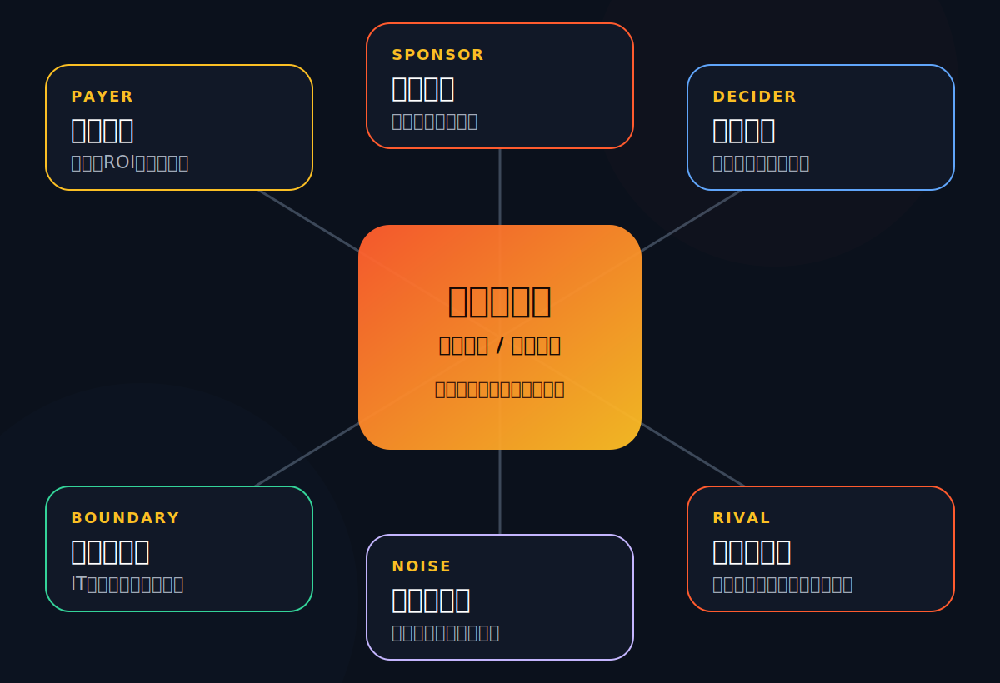

# Rolling Deck v2「影像玻璃」组件库 & 速查

跟 `rolling-deck` 同一套引擎（粒子地球封面、磨砂玻璃、固定 1920×1080 自动缩放、
翻页 / 全屏 / 编辑文字 / 导出 PDF），**不同的是视觉做法 + 配套组件**：v2 是
**影像玻璃（Cinematic Glass）**风格——大幅实景照片压在磨砂玻璃面板下，并配了一套
吃得住这种影像质感的版式（照片背景判断页、照片信息面板、全幅章节图、矩阵看板、
风险雷达、商业阶梯…）。讲什么内容由使用者填，这里只列"哪个信息形态用哪个组件"。

所有 class 都已在 `template.html` 的 `<style>` 里定义好——**直接用，别新写样式，
别动 `<style>` / `<script>`**。这份文件告诉你"哪个信息形态用哪个组件"。

> 图标：本 pack 用**内联 SVG 描边图标**（`<span class="icon-badge fire|blue|green|violet">`
> 里塞一个 `<svg viewBox="0 0 24 24">…</svg>`），不是 Lucide。照搬模板里现成的 svg path 即可。

---

## 配色 token（沿用 rolling-deck，用 `var(--x)`）
| token | 用途 |
|---|---|
| `--bg` #0c0e12 | 页面底色 |
| `--text` / `--muted` / `--subtle` | 正文 / 次要 / 更弱 |
| `--yellow` `--blue` `--violet` `--green` `--fire` | 五个强调色（矩阵象限 / 卡片图标 / 阶段） |
| `--glass-bg` / `--glass-border` | 卡片磨砂玻璃（`.card` 已用，别覆盖） |

强调词：`<span class="tenx-mark">10×</span>`（橙金渐变）、`<span class="kicker">SECTION 01</span>`（小标）。

## 每页骨架（同 rolling-deck）
```html
<section class="slide" data-slide-key="唯一英文key" data-screen-label="02 这页标题">…</section>
```
第一张必须是封面 `<section class="slide active cover-hero">`（保留模板原样，只改标题/副标题）。

## 标题区（几乎每页开头）
```html
<div class="section-head">
  <div><span class="kicker">01 · SECTION</span><h2>主标题<br>可两行</h2></div>
  <p class="copy">右侧导语，<strong>可加粗重点</strong>。</p>
</div>
```

---

## v2 标志性版式（这一套的价值所在）

### 1. 核心判断页 `thesis-canvas`（第 2 页总框架，刻意不像普通内容页）
全幅背景照 + 左侧大结论标题 + 右侧编号路线步骤。
```html
<div class="thesis-canvas">
  
  <div class="thesis-layout">
    <div class="thesis-title" data-anim="left">
      <span class="kicker">00 · CORE THESIS</span>
      <h2>核心变量<br>不是 A，<br>而是 B</h2>
      <p>一段说明。</p>
      <div class="synth-band" style="margin-top:34px;font-size:22px;">一句话：<strong>收口结论。</strong></div>
    </div>
    <div class="thesis-route">
      <div class="thesis-step" data-anim="right" data-anim-delay=".10"><div class="num">01</div><div><b>步骤名</b><span>一句说明。</span></div></div>
      <!-- 共 4 个 thesis-step，delay 递增 -->
    </div>
  </div>
</div>
```

### 2. 诊断矩阵 `matrix-dashboard` + `matrix-board`（3×3 / 2×2 框架）
左上空格 + 顶部列轴 + 左侧行轴 + 单元格。重点格加 `.hot`。
```html
<div class="matrix-dashboard">
  <div class="head" data-anim="rise">
    <div><span class="kicker">3×3 MATRIX · BASE × STYLE</span><h2>用九宫格确定打法</h2></div>
    <p class="copy">导语。</p>
  </div>
  <div class="matrix-board" data-anim="scale">
    <div></div>                                          <!-- 左上角空格 -->
    <div class="matrix-axis"><b>列1</b><span>说明</span></div>   <!-- 顶部列轴 ×3 -->
    <div class="matrix-axis"><b>列2</b><span>说明</span></div>
    <div class="matrix-axis"><b>列3</b><span>说明</span></div>
    <div class="matrix-axis"><b>行1</b><span>说明</span></div>   <!-- 每行：先一个行轴，再 3 个 cell -->
    <div class="matrix-cell hot"><span class="code">A1</span><h3>标题</h3><p>说明。</p></div>
    <div class="matrix-cell"><span class="code">A2</span><h3>标题</h3><p>说明。</p></div>
    <div class="matrix-cell"><span class="code">A3</span><h3>标题</h3><p>说明。</p></div>
    <!-- 再来两行 B*/C* -->
  </div>
</div>
```

### 3. 关系 / 利益相关方地图 `media-split`（左文右图）
左侧 kicker+标题+要点列表（+可选小图条），右侧一张大 SVG/图。
```html
<div class="media-split">
  <div>
    <span class="kicker">01 · RELATIONSHIP MAP</span>
    <h2>先画关系地图<br>再谈方案</h2>
    <p class="copy">导语。</p>
    <div class="scene-strip" style="grid-template-columns:repeat(2,1fr);">
      <div class="scene-photo"><b>图注</b></div>
      <div class="scene-photo"><b>图注</b></div>
    </div>
    <ul class="media-points">
      <li><b>要点标题。</b>说明句。</li>
    </ul>
  </div>
  <div class="media-frame">
    
    <div class="media-caption"><b>一句图注。</b>补充。</div>
  </div>
</div>
```
> 配套 SVG 业务图在 `assets/` 里：`family-map.svg` `work-modes.svg` `learning-system.svg` `business-model.svg`。换主题时重画这些 SVG 或换成照片。

### 4. 象限定位页 `visual-page` + `playbook-grid`（一行象限 → 一页打法卡）
左侧照片面板（带 `matrix-marker` 高亮本行所在格），右侧 3 张 `play-card`，每卡是「类型 / 核心痛点 / 工作方式 / 最有价值的 Offer」K-V 结构。
```html
<div class="section-head">…</div>
<div class="visual-page" style="grid-template-columns:.72fr 1.28fr;">
  <article class="visual-panel">
    
    <div class="visual-panel-content">
      <div>
        <span class="ai-mini-label">MATRIX POSITION · A · 优秀基础</span>
        <h3>这一行的判断。</h3><p>说明。</p>
        <div class="matrix-marker"><span class="hot">A1</span><span class="hot">A2</span><span class="hot">A3</span><span>B1</span>…</div>
      </div>
      <div class="visual-stat-stack">
        <div class="visual-stat"><b>对方最关心</b><span>…</span></div>
        <div class="visual-stat"><b>我们最关心</b><span>…</span></div>
      </div>
    </div>
  </article>
  <div class="playbook-grid" data-stagger="0.06">
    <article class="card play-card">
      <h3><span class="icon-badge fire"><svg viewBox="0 0 24 24">…</svg></span>卡片标题</h3>
      <p class="tagline">类型：优秀基础 × 虎妈式强控制</p>
      <div class="card-kv"><b>核心痛点</b><span>…</span></div>
      <div class="card-kv"><b>工作方式</b><span>…</span></div>
      <div class="card-kv"><b>最有价值的 Offer</b><span>…</span></div>
    </article>
    <!-- 共 3 张 play-card -->
  </div>
</div>
<div class="synth-band" style="position:absolute;left:112px;right:112px;bottom:38px;">收口结论。</div>
```

### 5. 服务模式页 `mode-panel-grid`（左大图标卡 + 右信息卡）
左侧 `mode-visual.photo-mode`（背景照 + 巨型编号 + 图注），右侧 `mode-info-grid` 里 3 张 `mode-info-card`（末张可 `.full` 通栏）。每页回答：核心工作 / 目标 / 方法与 Offer / 适用时机 / 最大风险。
```html
<div class="section-head"><div><span class="kicker">WORK MODE · 01</span><h2>企业诊断<br><span style="color:#ffb25b;">先把问题看清楚</span></h2></div><p class="copy">导语。</p></div>
<div class="mode-panel-grid">
  <article class="card mode-visual photo-mode">
    
    <span class="icon-badge fire"><svg viewBox="0 0 24 24">…</svg></span>
    <h3>诊断先行</h3><p>一句话定位。</p>
    <div class="mode-giant">01</div>
    <div class="mode-photo-label"><span>真实场景</span><strong>图注。</strong></div>
  </article>
  <div class="mode-info-grid">
    <article class="card mode-info-card"><h3><span class="icon-badge blue"><svg…></span>核心工作</h3><p>…</p></article>
    <article class="card mode-info-card"><h3><span class="icon-badge green"><svg…></span>目标</h3><p>…</p></article>
    <article class="card mode-info-card full"><h3><span class="icon-badge fire"><svg…></span>方法与 Offer</h3><p>…</p></article>
  </div>
</div>
```

### 6. 汇报治理板 `meeting-board`（左叙事面板 + 右会议网格）
左 `visual-panel`（照片 + 三个 `visual-stat`），右 `meeting-grid` 里 6 张 `meeting-card`（每张：时点 + 会议名 + 给谁看/汇报什么）。
```html
<div class="meeting-board" data-anim="rise">
  <article class="visual-panel">
    
    <div class="visual-panel-content">
      <div><span class="ai-mini-label">MEETING SYSTEM</span><h3>每次汇报都要让客户更安心</h3><p>…</p></div>
      <div class="visual-stat-stack">
        <div class="visual-stat"><b><span class="mini-ico"><svg…></span>走到哪</b><span>…</span></div>
        <!-- 3 个 -->
      </div>
    </div>
  </article>
  <div class="meeting-grid">
    <article class="card meeting-card"><span class="tl-date">W1</span><b>开局对齐会</b><p><strong>给谁看：</strong>…<br><strong>汇报：</strong>…</p></article>
    <!-- 6 张 -->
  </div>
</div>
```
> 另有 `report-dashboard`（高层汇报 / 利益相关方语言翻译）同族，结构相近：左可视面板 + 右分栏卡。

### 7. 风险指挥中心 `risk-command`（左雷达 + 右风险清单）
左 `risk-hero`（照片 + 标题 + `radar-stage` 雷达：同心环 `radar-ring a|b|c` + 扫描线 `radar-sweep` + 绝对定位的 `risk-chip`），右 `risk-lanes`（4 类风险泳道 `lane` + 风险条目 `risk-item`：信号 / 后果 / 处理）。
```html
<div class="risk-command">
  <article class="risk-hero" data-anim="left">
    
    <div class="risk-hero-content">
      <div><span class="kicker">RISK COMMAND CENTER</span><h2>风险要靠提前预警</h2><p>读法说明。</p></div>
      <div class="radar-stage" style="min-height:310px;">
        <div class="radar-ring a"></div><div class="radar-ring b"></div><div class="radar-ring c"></div><div class="radar-sweep"></div>
        <span class="risk-chip" style="left:6%;top:14%;">错认客户</span>
        <!-- 6 个 chip，绝对定位散布 -->
      </div>
    </div>
  </article>
  <div class="risk-lanes" data-anim="right">
    <div class="risk-lane-head">
      <div class="lane"><b>关系风险</b><span>错认客户 / 旁观干预</span></div>
      <!-- 4 类 lane -->
    </div>
    <div class="risk-list">
      <article class="risk-item"><b>R01 错认客户</b><span>信号：… 后果：… 处理：…</span></article>
      <!-- N 条 risk-item -->
    </div>
  </div>
</div>
```

### 8. 商业模式阶梯 `business-ladder` + 图表卡（机会 / 收口页）
左 `business-ladder`（5 级 `ladder-node n1..n5` + 底轴 `ladder-axis`），右 `chart-card`（KPI 网格 `chart-kpis` 里 `mini-kpi` + 收口 `synth-band`）。整体套 `chart-grid`。
```html
<div class="section-head"><div><span class="kicker">OPPORTUNITY MAP</span><h2>机会来自重建学习系统</h2></div><p class="copy">导语。</p></div>
<div class="chart-grid">
  <div class="business-ladder opportunity-visual-frame" aria-label="商业模式复制性阶梯">
    <article class="ladder-node n1"><div class="tag">01 SERVICE</div><b>一对一家教</b><span>说明。</span></article>
    <!-- n2..n5 -->
    <div class="ladder-axis"><span>低复制：专家小时</span><span>高复制：标准与平台</span></div>
  </div>
  <article class="chart-card">
    <h3>从专家时间到可复制资产</h3>
    <p class="chart-sub">副标。</p>
    <div class="chart-kpis">
      <div class="mini-kpi"><b>低复制</b><span>…</span></div>
      <!-- 4 个 -->
    </div>
    <div class="synth-band" style="margin-top:20px;font-size:20px;">收口结论。</div>
  </article>
</div>
```

### 9. 章节过渡（大图）
`chapter-*` 页用全幅生成 / 真实业务照 + 大结论标题 + 4 张紧凑阶段卡（沿用 rolling-deck 的 divider 思路）。**所有 Part 页保持同一种风格**。

### 10. 路线时间轴 `timeline`（默认 12 周路径）
```html
<div class="timeline">
  <div class="timeline-line"></div>
  <div class="timeline-nodes" style="grid-template-columns:repeat(4,1fr);">
    <div class="timeline-node"><div class="card tl-card"><span class="tl-date">W1-W2</span><b>识别客户</b><p>…</p></div></div>
    <!-- 4 节点 -->
  </div>
</div>
<div class="cadence-note"><strong>关键节奏：</strong>…</div>
```

### 11. 演讲地图 `agenda-list` + `map-route`
左侧编号议程 `agenda-item`（`agenda-no` + 标题 + 说明），底部一条 `map-route`（START→…→RISK 的 `map-step` 横条）。

### 12. 方法论总结 `summary-system` + `summary-steps`
左 `visual-panel`（照片 + 总结句 `visual-stat`），右 `summary-steps` 里 6 个 `summary-step`（编号 + 动作名 + 说明）。

---

## 继承自 rolling-deck 的通用件（仍可用）
`hero-stats` / `cards-3` `cards-4` + `.card` / `route-card` / `goals-grid` / `approach-grid` /
`calendar-wrap`+table / `org-stack` / `tl-weeks` / 页尾收口横幅 `synth-band` `band` `cadence-note`。
详见 `../rolling-deck/reference.md`。

## 注意事项
- 卡片只用 `.card` + 修饰类，**别加自定义不透明背景**（会盖掉玻璃质感）。
- 一页一个核心论点；矩阵 / 风险这类密集页本身就撑满，别再硬塞。
- 文字用语义标签（h2/h3/p/li/td/span）→ 自动可编辑、可导出 PDF。
- 配色强调靠文字色 / `icon-badge` / 小徽章，别回到大色块圆斑（刻意走"干净玻璃"风）。
- 章节结尾建议用一条页尾收口横幅（`synth-band`）收束——这套模板的标志性收口。
